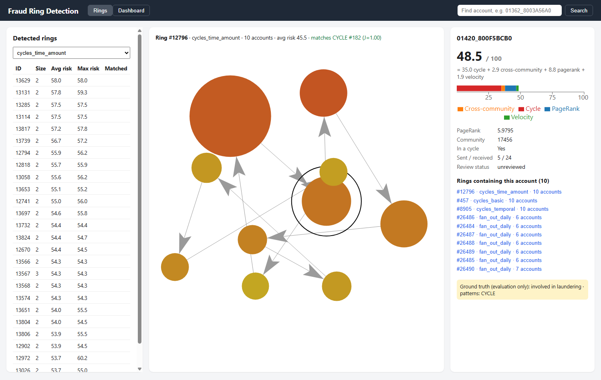
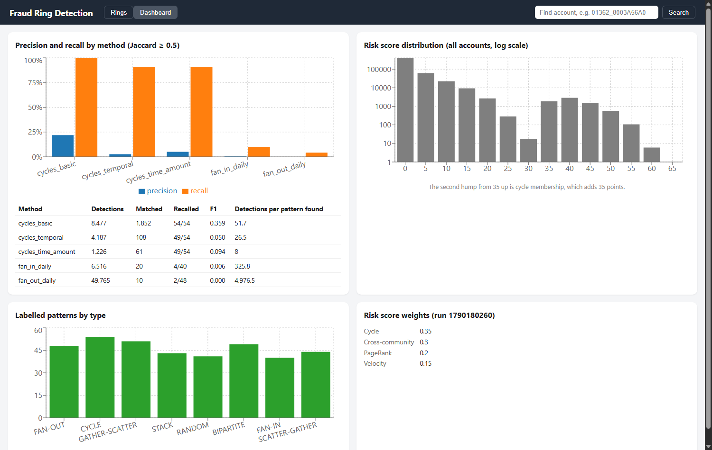
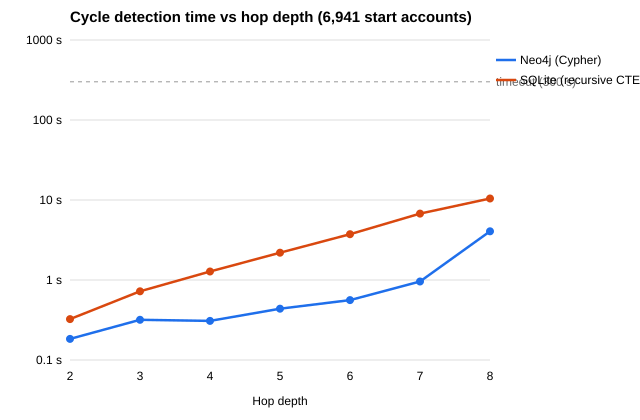

# Fraud Ring Detector

Graph-based detection of money-laundering rings in bank transactions, built on **Neo4j**.

The project loads the IBM *Transactions for Anti-Money Laundering* dataset (HI-Small: 5.08 million transactions between 515,088 accounts) into a graph database. It then:

1. **Detects laundering structures** with Cypher: cycles (money that returns to its origin), fan-in/fan-out hubs and multi-hop layering chains. Temporal and amount-conservation filters separate real laundering flows from ordinary back-and-forth payments.
2. **Runs graph algorithms** with Neo4j Graph Data Science: PageRank, Louvain communities, weakly and strongly connected components.
3. **Combines the signals into an interpretable risk score** that every account's score breaks down into, e.g. *48.5 = 35.0 cycle + 2.9 cross-community + 8.8 PageRank + 1.9 velocity*.
4. **Evaluates itself against the dataset's labelled laundering patterns**, entirely inside the graph (precision, recall, F1).
5. **Benchmarks Neo4j against SQL** (SQLite recursive CTE) for multi-hop cycle detection.
6. **Serves everything through a FastAPI backend and a React frontend** where an investigator can browse rings, see them drawn as graphs and read each account's risk breakdown.



---

## Key results

| | Result |
|---|---|
| Full load | 5,078,345 transactions in 15.6 min |
| Cycle detection (2–12 hops) | 12,885 rings → 4,224 time-ordered → **1,234** time-ordered with amounts conserved, ~25 s per query |
| Known cycles recovered | **49 of 54** labelled cycle patterns (Jaccard ≥ 0.5) |
| Effect of the filters | Detections per labelled pattern found: **51.7 → 8.0** (86% shorter review list, 7% of found patterns lost) |
| PageRank | Top 1,000 accounts are 6.8× more likely than average to be involved in laundering |
| Louvain | Modularity 0.898; cross-community transfers are **9.4×** more likely to be laundering |
| Risk score | Top 5,000 accounts: 9.8× the baseline laundering rate |
| Neo4j vs SQLite | Identical results at every depth; Neo4j **1.8× faster at 2 hops, 7× faster at 6–7 hops** |

Limitations are stated where they apply: daily fan detection recovers only 2/48 fan-out and 4/40 fan-in patterns, cycle membership dominates the risk score, the risk weights were chosen using the same labels they are evaluated against, and the benchmark is against SQLite rather than a server database.

---

## How it works

### Graph model

```
(:Account {accountId, bankId, accountNumber, pageRank, communityId, componentId,
           sccId, inCycle, riskScore, riskCycle, riskCrossCommunity, riskPageRank, riskVelocity})

(:Account)-[:SENT {transactionId, timestamp, amountPaid, amountReceived,
                   paymentCurrency, receivingCurrency, paymentFormat, isLaundering}]->(:Account)

(:Account)-[:FLOWS_TO {ts[], usd[], laund[], txCount}]->(:Account)   one per account pair
(:Account)-[:MEMBER_OF]->(:Detection {detectionId, method, target, size, avgRisk, bestJaccard})
(:Account)-[:IN_PATTERN]->(:Pattern {patternId, type, size})
(:Detection)-[:MATCHES {jaccard}]->(:Pattern)
```

`accountId` is `<bank code>_<account number>`, with bank codes kept exactly as written (converting them to numbers would merge 58 pairs of different banks).

### Why the ring search is built the way it is

A plain `(a)-[:SENT*2..12]->(a)` search runs out of memory on this graph, for two reasons: account pairs repeat transactions 6.9 times on average, and variable-length patterns revisit accounts before filtering. The detection pipeline therefore:

1. **Rolls transactions up into `FLOWS_TO`**: 647,939 relationships, one per sender→receiver pair, holding time-ordered lists of timestamps, USD amounts and laundering flags.
2. **Limits the search to strongly connected components** (GDS): only 4.5% of accounts can be on any cycle.
3. **Uses one fixed-length pattern per ring length** (generated by `gen_ring_queries.py`), so Neo4j rejects a repeated account at every hop.
4. **Checks time order and amount conservation** over the stored lists: a ring counts as temporal if some choice of real transactions around it moves forward in time, and amount-conserving if each hop passes on 50–120% of the previous hop's USD value.

### API design

Full-graph detection is precomputed and stored as `:Detection` nodes; searches anchored on one account run live (milliseconds to ~1 s). The API never runs an unbounded full-graph search on request.

---

## Repository structure

```
prep_slice.py            Phase 1  small slice + known cycles, for a first look
parse_patterns.py        Phase 2  labelled patterns -> fraud.db (SQLite ground truth)
prep_full.py             Phase 3  full dataset -> transactions.csv for LOAD CSV
fx_rates.py                       USD exchange rates derived from the dataset
gen_ring_queries.py      Phase 4/7 generates the ring queries in graph_queries/
graph_queries/           Phases 4, 5, 7  Cypher files, numbered in run order
risk_score.py            Phase 6  composite risk score (config: risk_config.json)
export_patterns.py       Phase 7  patterns -> CSV for loading into Neo4j
build_flows_sqlite.py    Phase 8  SQLite copy of FLOWS_TO (benchmark.db)
benchmark.py             Phase 8  Cypher vs SQL timing -> benchmark_results.csv
plot_benchmark.py        Phase 8  -> benchmark.svg
setup_api.py             Phase 9  one-time Neo4j setup for the API
app/                     Phase 9  FastAPI backend
web/                     Phase 10 React frontend (Vite)
```

---

## Requirements

- **Neo4j 2026.x** (tested with Neo4j Desktop) with the **Graph Data Science** and **APOC** plugins
  - Memory used: `server.memory.heap.initial_size=4G`, `server.memory.heap.max_size=4G`, `server.memory.pagecache.size=2G` (make sure there is only one `pagecache.size` line in `neo4j.conf`)
- **Python 3.12+**. The data scripts use only the standard library; the API and risk score need `pip install -r requirements.txt` (neo4j, fastapi, uvicorn)
- **Node.js 20+** for the frontend
- About 2 GB of free disk space for the data and database

### Configuration

Copy `.env.example` to `.env` and set your Neo4j password. `.env` is git-ignored.

```
NEO4J_URI=neo4j://127.0.0.1:7687
NEO4J_USER=neo4j
NEO4J_PASSWORD=your_password
NEO4J_DATABASE=neo4j
```

---

## Running the app

If the database is already built (all steps under *Building the database from scratch* done), start the two servers.

**1. API** (from the repository root):
```bash
python -m uvicorn app.main:app --reload --host 127.0.0.1
```
Interactive API documentation: **http://127.0.0.1:8000/docs**

**2. Frontend** (second terminal):
```bash
cd web
npm install        # first time only
npm run dev
```
Open **http://localhost:5173**.

Neo4j must be running. Useful demo links:
- `http://localhost:5173/#ring=12796&account=01420_800F5BCB0`: a 10-account ring that exactly matches labelled cycle #182
- `http://localhost:5173/#dashboard`: evaluation dashboard

### Using the frontend

- **Rings tab:** pick a detection method, minimum ring size (default 3; two-account rings are mostly ordinary back-and-forth payments), sort order, or *Matched only* to see rings that match a labelled pattern. Click a ring to draw it: colour = risk score (green → red), size = PageRank relative to the ring, arrows = direction of money flow. Click an account to see its score as a sum of its four parts and every other ring it belongs to. The yellow box shows the dataset's ground truth, for evaluation only.
- **Dashboard tab:** precision and recall per method, the risk-score distribution, labelled patterns by type and the risk-score weights.
- **Search:** open any account by ID, e.g. `01362_8003A56A0`.



### API endpoints

| Area | Endpoints |
|---|---|
| Accounts (CRUD) | `GET /accounts`, `POST /accounts`, `GET/PATCH/DELETE /accounts/{id}`, `GET /accounts/{id}/graph`, `GET /accounts/{id}/rings` |
| Transactions (CRUD) | `GET /transactions?account_id=…`, `POST /transactions`, `GET/PATCH/DELETE /transactions/{id}` |
| Rings | `GET /rings` (filters: `method`, `min_size`, `matched_only`, `sort_by`), `GET /rings/{detectionId}` |
| Live analysis | `GET /analysis/cycles?start_account=…`, `GET /analysis/chains?start_account=…`, `GET /analysis/risk-histogram` |
| Evaluation | `GET /evaluation`, `GET /runs/latest` |
| Health | `GET /health` |

Creating, updating or deleting a transaction rebuilds that account pair's `FLOWS_TO`, so the roll-up never drifts from the underlying transactions. Every query has a 30 s timeout.

---

## Building the database from scratch

Run everything from the repository root. **Cypher files** are run one at a time in the Neo4j Query tool (paste the file's contents); each file's header states the expected result. A query containing `IN TRANSACTIONS` needs `:auto ` at the start if the tool reports an "implicit transaction" error.

`<import>` below means your Neo4j instance's `import` folder (Neo4j Desktop: instance → *Open folder* → *Import*).

### 1. Data

Download `HI-Small_Trans.csv` and `HI-Small_Patterns.txt` from Kaggle (`ealtman2019/ibm-transactions-for-anti-money-laundering-aml`) into `data/`.

### 2. Ground truth and full load (Phases 2–3)

```bash
python parse_patterns.py        # -> fraud.db (370 patterns)
python prep_full.py             # -> transactions.csv (5,078,345 rows, ~2 min)
cp transactions.csv <import>/
```

In Neo4j:
```cypher
CREATE CONSTRAINT account_id IF NOT EXISTS FOR (a:Account) REQUIRE a.accountId IS UNIQUE;
```
```cypher
CREATE INDEX sent_ts IF NOT EXISTS FOR ()-[r:SENT]-() ON (r.timestamp);
```
```cypher
:auto LOAD CSV WITH HEADERS FROM 'file:///transactions.csv' AS row
CALL (row) {
  MERGE (a:Account {accountId: row.fromId})
    ON CREATE SET a.bankId = row.fromBank, a.accountNumber = row.fromAccount
  MERGE (b:Account {accountId: row.toId})
    ON CREATE SET b.bankId = row.toBank, b.accountNumber = row.toAccount
  CREATE (a)-[:SENT {
    transactionId: row.transactionId, timestamp: datetime(row.timestamp),
    amountPaid: toFloat(row.amountPaid), amountReceived: toFloat(row.amountReceived),
    paymentCurrency: row.paymentCurrency, receivingCurrency: row.receivingCurrency,
    paymentFormat: row.paymentFormat, isLaundering: toInteger(row.isLaundering)
  }]->(b)
} IN TRANSACTIONS OF 10000 ROWS;
```
Expect 515,088 accounts and 5,078,345 `SENT` relationships (~15 min).

### 3. Detection queries (Phase 4)

Run in order: `4a1` → `4a5` (build `FLOWS_TO`, strongly connected components), `4b1` → `4b3` (ring counts), `4c` (mark `inCycle`), then optionally `4d1`, `4d2`, `4e` (fan-in, fan-out, chains).

### 4. Graph algorithms (Phase 5)

Run `5a` → `5i` in order. `5i` should return 0 (every account has `pageRank`, `communityId` and `componentId`).

### 5. Risk score (Phase 6)

```bash
python risk_score.py     # ~4 min; weights in risk_config.json; each run logged to fraud.db
```

### 6. Evaluation (Phase 7)

```bash
python export_patterns.py
cp patterns.csv pattern_members.csv <import>/
```
Then run `7a1` → `7h` in order. Run each query only after the previous one has finished: `7d` must run after both fan queries (`7c1`, `7c2`) have completed.

### 7. API setup (Phase 9)

```bash
python setup_api.py      # numbers detections, precomputes ring risk, creates indexes
```

The app is now ready; see *Running the app*.

### Optional: benchmark (Phase 8)

```bash
python build_flows_sqlite.py    # -> benchmark.db, 647,939 pairs (same as FLOWS_TO)
python benchmark.py             # ~3 min -> benchmark_results.csv
python plot_benchmark.py        # -> benchmark.svg
```



---

## Notes

- **pandas is not used** anywhere: all data processing uses the Python standard library (`csv`, `sqlite3`).
- **Regenerating ring queries:** `python gen_ring_queries.py` (or `python gen_ring_queries.py 8` for a 2–8 hop range) rewrites the `4b`, `4c` and `7b` files. Edit the generator, not the generated files.
- **Ground-truth labels** (`isLaundering`, `evalLaunderingInvolved`, `:Pattern`) are used only for evaluation. The risk score never reads them.
- **Dataset:** E. Altman et al., *Realistic Synthetic Financial Transactions for Anti-Money Laundering Models*, IBM, via Kaggle.
